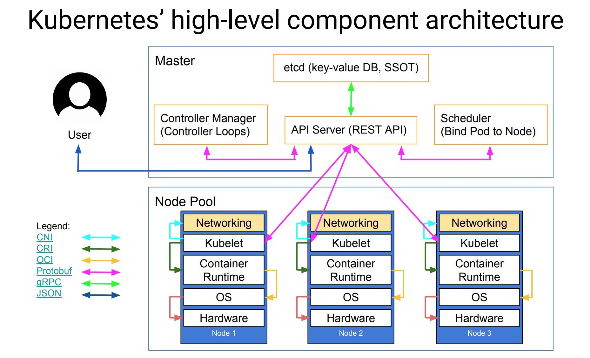

<!-- ex_nonav -->
 
 
 
 

<!-- 
+ account, inventory, shipping
+ api gateway
+ service discovery
 -->

 
 
 
 
 
 

---

 
 

<h1 style="font-size:250%;">核心组件</h1>
<ul style="font-size:150%;">
<li>etcd 保存集群所有的网络配置和对象的状态信息</li>
<li>Controller Manager 维护集群的状态，如故障检测、自动扩展、滚动更新</li>
<li>API Server 资源操作唯一入口，提供认证、授权、访问控制、API注册和发现等机制</li>
<li>Scheduler 资源调度，将 Pod 调度到相应的 Node 上</li>
<li>kube-proxy 为 Service 提供 Cluster 内部的服务发现和负载均衡</li>
<li>kubelet 维护容器的生命周期，同时也负责存储和网络的管理</li>
<li>Container Runtime 负责镜像管理以及 Pod 和容器的真正运行</li>
</ul>

 
 

 
 

<h1 style="font-size:250%;">Kubernetes 中的单元</h1>
<ul style="font-size:150%;">
<li>Container</li>
<li>Pod: 资源隔离和调度的最小单位，共享网络和存储，独立IP</li>
<li>Node: 网络隔离，每个节点都有单独的 IP 地址</li>
<li>Cluster</li>
</ul>

 
 
 

 
 

<h1 style="font-size:250%;">Sidecar</h1>

 
 

 
 

<h1 style="font-size:250%;">Services</h1>

